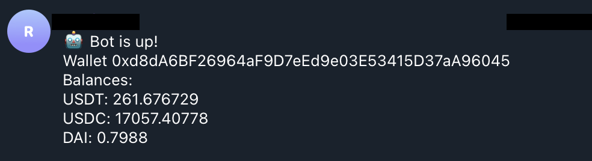
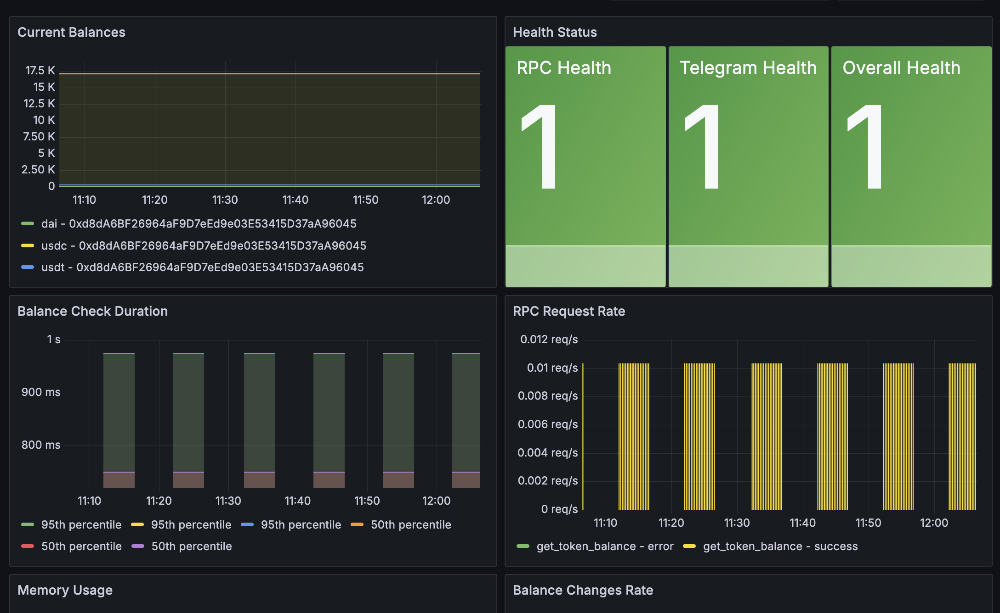

# ETH Balance Checker

A Python-based monitoring bot that tracks Ethereum token balances and sends notifications via Telegram when balances change. Includes comprehensive health monitoring and Docker support.

## 🚀 Features

- **Real-time Balance Monitoring**: Track multiple Ethereum addresses and tokens
- **Telegram Notifications**: Get instant alerts when balances change
- **Health Monitoring**: Built-in health check system with web endpoints
- **Docker Support**: Easy deployment with Docker containers
- **Configurable**: Flexible configuration for addresses, tokens, and intervals
- **Error Handling**: Robust error handling with detailed logging

## 📸 Screenshots

### Balance Monitoring

*Real-time balance monitoring with Telegram notifications*

### Grafana dashboard



## 📋 Prerequisites

- Python 3.11+
- Infura API key
- Telegram Bot Token
- Docker (optional)

## 🛠️ Installation

### Method 1: Local Installation

1. **Clone the repository**
   ```bash
   git clone https://github.com/br3d/eth-balance-checker.git
   cd eth-balance-checker
   ```

2. **Install dependencies**
   ```bash
   pip3 install -r requirements.txt
   ```

3. **Set up environment variables**
   ```bash
   cp env.example .env
   # Edit .env with your actual values
   ```

4. **Configure the bot**
   ```bash
   # Edit config.json with your addresses and settings
   ```

5. **Run the bot**
   ```bash
   python main.py
   ```

### Method 2: Docker Installation

1. **Build the Docker image**
   ```bash
   docker build -t eth-balance-checker .
   ```

2. **Run the container**
   ```bash
   docker run -d \
     --name eth-balance-checker \
     -e INFURA_URL="https://mainnet.infura.io/v3/YOUR_API_KEY" \
     -e TELEGRAM_BOT_TOKEN="YOUR_BOT_TOKEN" \
     -e TELEGRAM_CHAT_ID="YOUR_CHAT_ID" \
     -p 8000:8000 \
     eth-balance-checker
   ```

## ⚙️ Configuration

### Environment Variables (.env)

Create a `.env` file with the following variables:

```env
# Infura API configuration
INFURA_URL=https://mainnet.infura.io/v3/YOUR_INFURA_API_KEY

# Telegram Bot configuration
TELEGRAM_BOT_TOKEN=YOUR_TELEGRAM_BOT_TOKEN
TELEGRAM_CHAT_ID=YOUR_TELEGRAM_CHAT_ID
```

### Configuration File (config.json)

```json
{
  "ethereum_addresses": [
    "0xd8dA6BF26964aF9D7eEd9e03E53415D37aA96045"
  ],
  "coins_list": ["usdt", "usdc", "dai"],
  "checking_interval": 600,
  "log_level": "INFO"
}
```

<details>
  <summary>Tokens list.</summary>
  
  ```
   TUSD
   dDai
   dUSDC
   GST2
   TGBP
   NRM
   TCAD
   TAUD
   THKD
   AMON
   C10
   IPSX
   HUBS
   NOT
   CWIOS
   CIG
   SPZ
   STX
   22x
   DUCAT
   KPX
   FKX
   dLETH3x
   STATE
   INF
   EXC
   VN
   VNXLU
   BALI
   PYN
   ICOS
   USC
   KXC
   BEAR
   ASY
   INX
   PLA
   UAT
   MESH
   RET
   BREZ
   DPP
   SPT
   LULU
   BFT
   CZR
   OCC
   GTKT
   BTCA
   OTO
   PKG
   LIKE
   SPICE
   BTC++
   STU
   KCS
   ENC
   BTRN
   RAI
   DSCP
   uniAMPL
   OMT
   SKM
   FLOT
   uLZRX2x
   SETS
   CAPP
   FLMC
   XET
   WYV
   GUSD
   CBIX
   LCT
   MFTU
   SPX
   ZIL
   CK
   ACE
   BAC
   TKLN
   uniNEXO
   Skey
   CHAI
   FAME
   FNKOS
   usBAT3x
   DEEZ
   CBT
   usBAT2x
   uniANT
   DALC
   DLT
   BTT
   CRPT
   XCL
   uniIOTX
   EDG
   sLTC
   BTCE
   BIT
   XPT
   BITCAR
   DCN
   TNT
   TIK
   uLREP4x
   iBNB
   LND
   RNDR
   STB
   uniSAI
   WCK
   GZM
   FRD
   MTX
   DNT
   PLBT
   DAX
   PRSP
   ARNX
   veOGV
   NUSD
   COIL
   XDATA
   J8T
   KC
   BAT
   EXE
   CR1
   IQN
   ROCK2PAY
   uniBLT
   ABYSS
   CPAY
   PCL
   YUP
   LEV
   XSC
   MANA
   1SG
   FABA
   LGO
   GROW
   ITT
   RIYA
   API3
   INT
   CEN
   SWFTC
   YFI
   IST34
   uniPAXG
   MNL
   AVT
   PDATA
   POE
   YAM
   usETH4x
   DAO
   XIO
   XMX
   PIT
   FUKU
   TMTG
   BCV
   GVT
   UMKA
   AIX
   RKT
   BLT
   SYN
   VRO
   CENNZ
   QVT
   uniTRYB
   CAT (BitClave)
   LGO (old)
   ARCT
   SUB (old)
   TRAK
   uLETH4x
   GRID
   SXDT
   CFI
   GBX
   IMT
   MCI
   BOUTS
   PHI
   SKE
   ACC
   REMI
   DIVX
   RCT
   iSAI
   KAN
   HV
   dsBAT2x
   CHX
   xHNS
   BETHER
   HKG
   DEB
   XOV
   ATH (AIgatha Token)
   cREP
   RFX
   QBIT
   PRS
   RBT
   IIC
   RHOC
   BTQ
   ENQ
   XFS
   UTT
   ATH
   OWN
   ECOM
   JOB
   NMR
   GCG
   CDT
   ECO2
   uniVERI
   FREC
   NBAI
   ALCO
   FXT
   PRL
   uLREP2x
   usETH3x
   AUDIO
   BZZ
   FAM
   uLKNC4x
   MTC
   BDG
   NDX
   ISL
   HEM
   REP
   SNBL
   dLETH3x
   ATX
   CTT
   sTRX
   DATABroker
   dLZRX2x
   VERSI
   ETBS
   TORA
   YNN
   ROC
   BLO
   SONIQ
   uniCVC
   DGTX
   FACE
   AKC
   THR
   iLINK
   TALAO
   XCLR
   S-A-PAT
   SOL
   BNT
   RNTB
   LTD
   BYTE
   APPC
   MNE
   uniSNT
   dLLINK2x
   WISH
   VITE
   BCPT
   PSK
   TEAM
   iKNC
   DAF
   XLX
   CAN
   WSS
   CURE
   CDT
   SPD
   CCS
   DSC
   uniCELR
   MTRc
   BCDN
   CARD
   BCAP
   UNI
   CLT
   ZCO
   usBAT4x
   FTR
   BTP
   DEW
   SPN
   CARCO
   CXC
   WAY
   OIKOS
   LOK
   MRP
   REPv2
   NTWK
   WBTC
   PRO
   GSC
   IMT
   GXVC
   xSOL
   uniSOCKS
   uLETH3x
   FDZ
   SOCKS
   MAS
   APT
   VIT
   GELD
   dLREP4x
   KWATT
   NUG
   QBX
   UKG
   GNY
   LIVE
   SPARTA
   SCRL
   ING
   aETH
   LOOK
   RDN
   LML
   BID
   PKT
   MOT
   QUN
   uniGEN
   CBC
   C20
   ftc
   AST
   KICK
   ALEPH
   DRP
   BOK
   AIR
   CCC (CryptoCrashCourse)
   usBAT
   STACS
   WABI
   sUSD
   EMB
   NPX
   ETG
   TCNX
   XBP
   ITO
   VALOR
   dsETH
   usETH
   CSNO
   BAS
   EDU
   dsBAT
   FIG
   OUSD
   dLZRX3x
   FTT
   HAREM
   KMTBA
   dsETH4x
   MSI
   uniNMR
   TAN
   QTQ
   uniMKR
   OST
   TRYB
   dsETH3x
   SXUT
   VID
   VIB
   DCB
   xKLAY
   ZENI
   uniBAT
   MET
   PFR
   FOOD
   uniDAI
   TDH
   RCT
   PTC
   AQT
   BTL (Battle)
   UCBI
   HEX
   SKIN
   ADB
   LGC
   CRBT
   CDX
   DMT
   SOC
   JSE
   ATS
   SMT
   DICE
   TWN
   LGR
   BC
   REV
   LATX
   dsWBTC4x
   STM
   NUMA
   dsKNC2x
   GTEC
   PESO
   TRCT
   XGT
   COFI
   CCS
   TDX
   CPAL
   usWBTC4x
   EBC
   RSR
   TMT
   imBTC
   SKRP
   usETH2x
   BPT
   SRX
   BAD
   CCT
   SGP
   TRDT
   VEE
   unicDAI
   UUU
   BABYTRUMP
   DENT
   EPX
   BBN
   OLDPCL
   aDAI
   BTO
   ESB
   FRX
   SGT
   CCCX
   dLLINK4x
   BBI
   AID
   CIV
   SPHTX
   BEZ
   MBRS
   DCA
   THETA
   MITH
   HPB
   AMO
   SMS
   uLZRX4x
   GFN
   uniSNX
   DCL
   cUSDC
   WAX
   SYSX
   MIC
   dsETH
   sXAG
   BRX
   TBX
   SHUF
   PRIX
   YOUC
   CNDL
   iLINK
   uniiDAI
   CMBT
   WIB
   RTH
   uniRPL
   FLP
   ETHB
   CJT
   LGC
   ICD
   ETK
   DROP
   NFTL
   BKRx
   RVT
   CLL
   S-ETH
   CYFM
   M-ETH
   OR
   MGO
   usKNC3x
   iTRX
   REN
   OCN
   AIX
   SALT
   CLN
   usKNC2x
   uniLOOM
   FTXT
   FUN
   DRGN
   XDCE
   FCO
   MTN
   CVC
   RVL
   FARM
   MESG
   ADST
   GOT
   CAR
   LOOM
   FOTA
   ALI
   PICKLE
   SPANK
   TREND
   3LT
   uLWBTC3x
   DF
   OPT
   BZ
   uniREN
   OBC
   POIN
   usZRX
   ELTCOIN
   dsREP2x
   EVO
   XMCT
   EWO
   VIDT
   ADX
   IGI
   GCX
   SNIP
   MOZO
   BKX
   P2PS
   CTF
   KZEN
   OXT
   PAXG
   unicSAI
   NxC
   RAO
   YFV
   KIND
   STRC
   KRL
   dsKNC4x
   DROP
   PFB
   sLINK
   PTT
   SYS
   xNU
   HTX
   CS
   NUT
   CMCT
   EQL
   PXG
   aTUSD
   sGBP
   dsZRX3x
   uniREP
   HAND
   FRV
   INRM
   R
   CUR8
   CTSI
   HER
   PTON
   FOAM
   DEX
   ROUND
   SKO1
   BTR
   XBL
   ALX
   LKY
   uniKNC
   LCT
   RLX
   STABIT
   ZINC
   uniGRID
   sJPY
   WAB
   APIS
   KEY
   KRW-G
   AION
   WPR
   KEY
   MYST
   ONE
   BEE
   CAR (CarBlock)
   AMB
   FND
   XAUR
   cETH
   CREDO
   FTM
   ETF
   FER
   $FFC
   uniDATA
   dLWBTC4x
   GEE
   CELR
   uniWCK
   BUSD
   GRG
   QNT
   MITX
   FXC
   BBK
   NAOS
   SKB
   VUU
   SKR
   RGS
   SenSatorI
   NPER
   uniWBTC
   XCC
   sXAU
   uniSPANK
   ORX
   dLETH2x
   THRT
   DGX
   NU
   DIRTY
   MORE
   uniTUSD
   uniTHKD
   BST
   EPY
   LDC
   AI
   IDH
   LINK (Chainlink)
   MUXE
   TENX
   GDAO
   ORME
   VIU
   BPF
   MDA
   BWN
   pBTC
   eUSD
   MOB
   FID
   PCLOLD
   XGM
   YTRO
   uniSHUF
   BLUE
   GEN
   RTN
   PTWO
   XYO
   HST
   ZMN
   NIO
   PBL
   BRD
   SMT
   DGX1
   PEXT
   TRCN
   HUSL
   CAT
   XNT
   BLZ
   CO2Bit
   sUSD
   ORACLE
   VDG
   LYM
   NAVI
   PET
   NOAH
   LPT
   SPARC
   GXC
   LGD
   PLASMA
   POWR
   FLMC
   STN
   HAPPY
   usREP3x
   BQX
   HORSE
   MAD
   INS
   MEST
   ENTRP
   dLETH4x
   dLKNC2x
   AE
   NKN
   NTK
   POP
   599GTO1
   ENGT
   aDAI
   CFC
   ITO
   ITC
   dsKNC3x
   REBL
   PSDN
   AUS
   LOVE
   ICE
   EVED
   BTCL
   DTH
   LEDU
   FORK
   HABS
   BKB
   STQ
   VSL
   NXX OLD
   EXY
   cDAI
   NCC
   PST
   B2BX
   NAS
   LUC
   LOC
   WiC
   EZT
   sETH
   uniFAME
   OAK
   COIN
   OGK
   LCN
   uniUNI-V1:SAI
   RLC
   LEMO
   uniFUN
   TIC
   SGT
   DAXT
   uniDIP
   QASH
   uLWBTC4x
   WPC
   DRP
   AUTO
   FLX
   SSP
   TBC
   STC
   WIC
   DRVH
   ATTN
   uLETH2x
   ALTS
   LNC
   BOX
   GAME
   MWAT
   NONE
   TAUR
   OLT
   IPL
   COSS
   TIME
   Ox Fina
   FUCK
   ADL
   MDS
   CTX
   PT
   MEDCASH
   dsREP4x
   WINGS
   HLX
   LMY
   UBEX
   MFG
   QAU
   dsWBTC2x
   CRED
   SENSE
   GANA
   POA20
   ZAP
   TLN
   CCO
   SELF
   GNO
   sEUR
   WMA
   ONL
   GAT
   QCH
   SIG
   EVN
   MSP
   DST
   SRN
   CATs (BitClave)_Old
   iBBT
   ETR
   dsKNC
   PATENTS
   CFTY
   QRL
   NTK
   OPEN
   BTCR
   DAI
   SUSHI
   MM
   TSW
   LNC (Linker Coin)
   FYZ
   UP
   uniCHAI
   cBAT
   SIH
   VBX
   GENE
   SKRP
   GNX
   ITR
   dLBAT2x
   ORCA
   SMART
   YEED
   LG
   WCT
   BERRY
   DGS
   ID7
   sBTC
   uniTGBP
   HOT (Holo)
   dLWBTC3x
   SWRM
   HT
   OHNI
   IOTX
   UMB
   CDX
   PROPS
   uni0xBTC
   OAX
   POLL
   CPLO
   GAVEL
   UTK
   FLX
   XSGD
   MVG
   GLA
   AXN
   WRK
   OCTO
   TIC
   CORI
   WOLK
   GHX
   SKYM
   KEE
   WRC
   NGC
   usWBTC2x
   BCBC
   AMN
   AGRS
   BTE
   JASMY
   SNT
   xOXT
   BOA
   WBA
   BeerCoin
   ERO
   OKB
   uniQCH
   GBT
   ARD
   NXX
   BETR
   PRPS
   IFT
   DTX
   REA
   RED
   DOW
   BTD
   PYLNT
   ARX
   PRG
   JET
   OPQ
   PASS
   CAS
   POOL
   iETH
   BOXX
   ATL
   SMT
   FT
   CYMT
   SCANDI
   SLY
   MKT
   EDI
   ZDC
   ZCS
   RTC
   SLT
   OCEAN
   ASTRO
   uniXIO
   SAN
   xDOT
   uniRDN
   MATIC
   $TEAK
   RMC
   GMT
   uniUSDS
   BOP
   OHNI
   TICO
   CR7
   GGC
   MTR
   CLP
   HIN
   dLKNC4x
   AAVE
   DEPO
   FAR
   uniaDAI
   CAG
   VR
   FANX
   AGS
   CMC
   eosDAC
   usREP4x
   FANX
   BRLN
   VNM
   SPC
   NCASH
   CRPT
   TIO
   LYNX
   MGN
   LEND
   dLETH2x
   NEWB
   IDEA
   MDT
   ZERA
   KIN
   PMNT
   DAT
   uniiSAI
   OGN
   MRL
   RBX
   ADC$
   CATS
   WATT
   VDOC
   uniQSP
   DNA
   DREAM
   DTx
   iBTC
   OPTI
   REM
   dsBAT3x
   MNTP
   ZXC
   VOISE
   UBT
   dsETH2x
   WEB
   WTT
   Hdp.ф
   PMA
   AMTC
   dsWBTC3x
   sMKR
   BBO
   MEED
   SPF
   SHL
   OETH
   IETH
   TEL
   MOC
   RING
   EOS
   HDLRE
   CNN
   JET
   EPH
   CMOS
   uniBNT
   BTCONE
   ADI
   00
   OTN
   VIBEX
   JBX
   ECP
   SKRT
   ATT
   dLBAT4x
   ICN
   MBC
   PRE
   IKB
   FYN
   HKY
   CPT
   uniTAUD
   Unicorn
   aBAT
   REF
   BULLA
   LAMB
   WIN
   DEPO (Depository Network)
   SAI
   WWX
   NTO
   PTOY
   PEG
   GZE
   RMESH
   SUB
   KNDC
   USDP
   dLETH4x
   GC
   FYP
   WCN
   SPAZ
   SIFT
   sCEX
   MVP
   GET
   IG
   uniSAN
   CDL
   BET
   WDOGE
   TOMO
   FR8
   NAC
   BZR
   TBTC
   DXT
   uniXCHF
   TUSD (OLD)
   EGT
   UMKA
   AGI
   PIX
   TOOR
   VERI
   DATA
   REQ
   ORN
   HAT
   EARTH
   GIV
   FAN
   NAMTT
   usZRX3x
   PRO
   XPA
   MTC
   DOR
   X8X
   PUSSY
   KNINE
   REAL
   YEE
   VLD
   EVE
   CRMT
   BTL (Bitlle)
   SLIMER
   uniGST2
   ERT
   MDS
   VRS
   ARE
   dLLINK3x
   SPIRIT
   UCASH
   URB
   PIXIE
   COBR
   NCC
   dsLINK4x
   TTC
   MCAP
   PNK
   HAK
   pUSD
   FTI
   RING
   MDX
   AMIS
   EMT
   KZN
   FLUZ
   CARD
   MOD
   HDL
   uniTRST
   SHIB
   EMONT
   CBM
   HEX
   ANT
   OCEAN
   CTR
   Thar
   VZT
   ATMI
   uniUSDC
   SIBU
   SNM
   GULD
   BMX
   SEXY
   ATG
   TCST
   EAGLE
   TCH
   IDRT
   BANCA
   POLY
   TIE
   EGG
   QSP
   JBD
   DRT
   HOT (Hydro)
   GIRL
   QDT
   MRS
   ATM
   CPT
   DAN
   dLKNC3x
   HNST
   TTU
   GZB
   usWBTC
   NCT
   BRAT
   CTGC
   NBC
   BOLT
   PATR
   STAC
   BAX
   TOK
   aREP
   QTUM
   uniMATIC
   VD
   AOA
   FLR
   AXP
   DBET
   HIBT
   LOCI
   OGV
   DUBI
   GATE
   OLE
   usREP2x
   UTNP
   EXC
   HKN
   SWM
   COSS
   LDX
   BTY
   WAK
   MKR
   2DC
   dsWBTC
   dLWBTC2x
   GMB
   XES
   FXY
   USDC
   SWASH
   SENC
   NPXS
   TECH
   EVF
   uniWETH
   uniPOA20
   DACS
   PRON
   ROOBEE
   ROCK
   TOOLS
   USDS
   LOOM
   IVY
   CARB
   MUSD
   uniLRC
   NDC
   GL
   LUCHOW
   aMANA
   uLKNC3x
   WORK
   uniSTORJ
   NAMTC
   iZRX
   NEU
   uniRLC
   MVL
   LUM
   iBAT
   uniMLN
   MNT
   ZIP
   LCS
   uLBAT4x
   UCN
   MRV
   TNO
   iXTZ
   ADX
   ECP
   dLREP3x
   VINU
   TBT
   HMC
   EVCO
   FMTA
   dsLINK
   FUCK
   YAMv2
   EURT
   TGT
   ARC
   BCDT
   MIT (Mychatcoin)
   CRB
   KRP
   1ST
   CARD
   MAGIC
   XID
   SS
   SEELE
   SGN
   BRP
   ONEK
   XRL
   MINDS
   SPCTR
   BKB
   ONOT
   cZRX
   ABDX
   XCHF
   TKR
   RPL
   CO2
   REDC
   uLBAT3x
   LEMO
   OMX
   NEXO
   MCO
   MBC
   STORJ
   ADCO
   0xBTC
   GTC
   EMV
   BNB
   NULS
   BEFX
   unisUSD
   PAY
   ABT
   PAI
   SWT
   DKP
   VSF
   ARN
   iWBTC
   STR
   EKT
   AXS
   XPAT
   CST
   DAO
   LRC
   XNK
   SNOV
   GUESS
   A18
   CCC
   MLN (old)
   EDX
   WMK
   A18
   PEP
   SOUL
   CALL
   iREP
   CVT
   BKN
   OJX
   dsETH2x
   CTL
   SNX
   WETH
   uniPAX
   uniSALT
   HVN
   DONUT
   cWBTC
   KICK
   ROCK2
   GROO
   STL
   IAD
   aUSDT
   OWT
   BOU
   DRC
   aLINK
   uLKNC2x
   IoT
   AXPR
   CMERGE
   COSM
   OTO
   iDEFI
   GTO
   LOCUS
   sXRP
   VNTY
   uniMANA
   OLD_MKR
   UPP
   CTG
   WLKRR
   SWAP
   WILC
   AMLT
   BLN
   CIG
   SGR
   SLP
   uniMOD
   HUR
   aKNC
   BUC
   QBIT (Old)
   TRST
   fstETHDAI
   IDXM
   NIO
   GBO
   BON
   NEC
   RPE
   AX1
   AURA
   E4ROW
   ORBK
   EDO
   NLYA
   UQC
   FSN
   ADT
   STORM
   WORK
   uLBAT2x
   BNP
   LQD
   WOUSD
   WILD
   XHT
   AMPL
   ELEC
   DUBI
   aUSDC
   uniDONUT
   MEME
   uniDGD
   PAN
   BCMC1
   WLKR
   SOAR
   HNI
   BTNG
   MILC
   USDM
   XPR
   sETH
   VEN
   xGRAM
   PLU
   uniRCN
   iMKR
   YUP
   TST
   BNN
   NCR
   TEN
   COTI
   JOY
   DELTA
   MFT
   BOB
   iCEX
   WOETH
   HBT
   ETCH
   dsZRX
   BMC
   DGD
   BZNT
   uniMBC
   HB
   ZMAN
   JC
   LINK Platform
   COV
   HBZ
   MHLK
   PCH
   CTT
   PRPS
   ZRX
   DNX
   PLAY
   DONK
   CryptoCarbon
   LA
   ETHPAY
   sBNB
   DOCK
   TFD
   RAE
   BLX (Iconomi)
   Fzcoin
   BTZ
   GZR
   PIPL
   dsETH4x
   ADH
   uniAMN
   LIBER
   TaaS
   dLBAT3x
   DAY
   RATING
   ZTX
   SION
   REP
   Hdp
   UFR
   QKC
   FUEL
   ALIS
   PLEB
   LIF
   ORS
   HYDRO
   ID
   CNB
   RTB
   TCT
   ZIPT
   BHPC
   DOW
   SHP
   SHIT
   LRC (old)
   CTXC
   TIX
   VENUS
   TEL
   dsREP3x
   INV
   DUBI
   IHT
   POS
   TIG
   BNC
   PUC
   BOL
   MBCASH
   iUSDC
   MESH
   VIEW
   CRT
   aLEND
   uniLINK
   BSDC
   PAT
   BITPARK
   VIN
   SNC
   CRC
   MTL
   WHEN
   NOBS
   uLREP3x
   PBT
   uniPNK
   CGT
   uniPAN
   cSai
   ENJ
   CET
   GAM
   WOLK
   STAR
   VRE
   sDEFI
   TNB
   uniC20
   PATH
   BANX
   TGAME
   RCN
   uniTCAD
   WOC
   EDC
   IOST
   BTT
   TBC2
   VEGAN
   BTH
   LUCK
   aWBTC
   REEF
   METM
   RNT
   OSPVS
   QRG
   SVG
   NANJ
   DCC
   A
   uniimBTC
   EXR
   DADI
   RBLX
   GIF
   dsLINK3x
   Viz
   BCAP
   ECGO
   BTHR
   ANT
   usKNC
   DRC
   EGX
   SGEL
   YFII
   ICO
   MTA
   G-CRE
   MET
   SENT
   BOBBY
   GCU
   ECN
   ARY
   JNT
   TICO
   MYST
   sAUD
   EKO
   GNT
   TFL
   INXT
   UNQT
   TTV
   dsLINK2x
   HIG
   ELY
   TRAC
   TKN
   DATX
   GIM
   STK
   uniZRX
   300
   MTH
   ARB
   eBCH
   TTA
   XNN
   SAC
   DOV
   SNGLS
   SEV
   TNS
   CEEK
   SHIRO
   uLZRX3x
   ARXT
   ETHBNT
   CLB
   COB
   BIX
   TLX
   GMT
   GRMD
   HODL
   FMF
   eGAS
   ICX
   BCASH
   KPR
   ZPR
   EVC
   E\u20b9
   EMON
   BTU
   CXO
   uniTKN
   dsZRX4x
   uniKIN
   CPEX
   WTC
   MARS
   uniDGX
   uniENJ
   ZCN
   WBX
   XPAY
   BWX
   KRTY
   FNTB
   CARE
   OX
   BAL
   HGT
   HUB
   CHSB
   SS
   BCL
   CNDL
   uLWBTC2x
   xMOBILECOIN
   SVD
   RLTY
   ELF
   ODE
   COMP
   GANA
   wPAW
   AUC
   PXT
   CC3
   DTRC
   TAU
   ANIME
   dsBAT4x
   VOC
   PPP
   uniLPT
   LG
   EDR
   NUKE
   BDT
   DGTX
   LYM
   DIP
   INSTAR
   BAR
   FOX
   LFR
   GEM
   BKC
   ELIX
   usKNC4x
   LVN
   FXC
   GRT
   ORME
   KLOWN
   EXMR
   AEUR
   ROK
   YEED
   TRC
   VEGA
   BTM
   DDF
   RLT
   ANJ
   GR
   BLX (Bullion)
   SNG
   uniLEND
   ABPT
   HMQ
   YOYOW
   BTR
   SPACE
   ABCH
   usZRX2x
   NET
   GEFT
   RFR
   NCASH
   DTR
   SGT
   OMG
   VIKKY
   ORI
   BNTY
   RYLT
   TKP
   ONG
   CCLC
   C8
   uniHOT
   CND
   PPT
   FTX
   LEMO
   WNK
   SCL
   EVN
   iXRP
   VMC
   DAV
   NEEO
   WYS
   FRECNX
   BMC
   PRPS
   RDV
   EUCX
   SKM
   ADX-LOYALTY
   FGP
   BNFT
   cV
   USDT
   EURS
   TRC
   CVS
   usREP
   LYS
   BNC
   RUNE
   TKA
   DAB
   GCP
   JOT
   BTK
   ETHD
   UTK
   RIPT
   uniMGN
   Devcon2 Token
   KNC
   usZRX4x
   KUE
   FIH
   JOB
   MTC
   EXU
   SET
   ALTA
   sXTZ
   SUR
   KAPA
   dsZRX2x
   BOX
   WHO
   MIT
   SHIP
   MAN
   PURC
   NIMFA
   mUSD
   DRPU
   dsREP
   uniLQD
   PLR
   IMC
   ZST
   PLS
   EXRN
   GSE
   BRUH
   FTC
   BBC
   ZEUS
   CL
   CAS
   ESZ
   VIBE
   uniGNO
   WHO
   HEY
   unisETH
   uniOXT
   OPEN
   GOLDX
   EBTC
   uniRING
   PETRO
   NOX
   AVA
   dsETH3x
   VRS
   PASS
   GOVI
   PARETO
   MUSH
   USDx
   COIN
   GTH
   $MIRX
   MLN (new)
   iLTC
   STP
   SGA
   KRI
   DNA
   BMT
   FLIXX
   REX
   ENG
   TRUCCO
   DIT
   AMGO
   TRX
   RUFF
   SND
   ZIX
   EVX
   CHP
   CPY
   MRK
   CRGO
   RFX
   LOOKS
   PETH
   iETH
   BAMBOO
   XGG
   DGPT
   xEDG
   CIYA
   uniFOAM
   GUP
   VOTOS
   usWBTC3x
   MYD
   dLZRX4x
   CMT
   IND
   XAMP
   TGT
   LEO
   EHT
   DTT
   TCA
   CPC
   USD-G
   AFA
   aDAI
   SXR
   LALA
   dLREP2x
   1WO
   CYCLE
   sCHF
   LIFE
   AMP
   KNT
   HDG
   LUN
   BOA
   xKDA
   TWNKL
   IXT
   PCH
   MEDX
   ZLA
   SKRP
   MART
   BHR
   LBA
   THUG
   PAL
   ART
   BITX
   ORBS
   URAC
   DEC
   DXR
   ⌘
   TUSD
   dDai
   dUSDC
   GST2
   TGBP
   NRM
   TCAD
   TAUD
   THKD
   AMON
   C10
   IPSX
   HUBS
   NOT
   CWIOS
   CIG
   SPZ
   STX
   22x
   DUCAT
   KPX
   FKX
   dLETH3x
   STATE
   INF
   EXC
   VN
   VNXLU
   BALI
   PYN
   ICOS
   USC
   KXC
   BEAR
   ASY
   INX
   PLA
   UAT
   MESH
   RET
   BREZ
   DPP
   SPT
   LULU
   BFT
   CZR
   OCC
   GTKT
   BTCA
   OTO
   PKG
   LIKE
   SPICE
   BTC++
   STU
   KCS
   ENC
   BTRN
   RAI
   DSCP
   uniAMPL
   OMT
   SKM
   FLOT
   uLZRX2x
   SETS
   CAPP
   FLMC
   XET
   WYV
   GUSD
   CBIX
   LCT
   MFTU
   SPX
   ZIL
   CK
   ACE
   BAC
   TKLN
   uniNEXO
   Skey
   CHAI
   FAME
   FNKOS
   usBAT3x
   DEEZ
   CBT
   usBAT2x
   uniANT
   DALC
   DLT
   BTT
   CRPT
   XCL
   uniIOTX
   EDG
   sLTC
   BTCE
   BIT
   XPT
   BITCAR
   DCN
   TNT
   TIK
   uLREP4x
   iBNB
   LND
   RNDR
   STB
   uniSAI
   WCK
   GZM
   FRD
   MTX
   DNT
   PLBT
   DAX
   PRSP
   ARNX
   veOGV
   NUSD
   COIL
   XDATA
   J8T
   KC
   BAT
   EXE
   CR1
   IQN
   ROCK2PAY
   uniBLT
   ABYSS
   CPAY
   PCL
   YUP
   LEV
   XSC
   MANA
   1SG
   FABA
   LGO
   GROW
   ITT
   RIYA
   API3
   INT
   CEN
   SWFTC
   YFI
   IST34
   uniPAXG
   MNL
   AVT
   PDATA
   POE
   YAM
   usETH4x
   DAO
   XIO
   XMX
   PIT
   FUKU
   TMTG
   BCV
   GVT
   UMKA
   AIX
   RKT
   BLT
   SYN
   VRO
   CENNZ
   QVT
   uniTRYB
   CAT (BitClave)
   LGO (old)
   ARCT
   SUB (old)
   TRAK
   uLETH4x
   GRID
   SXDT
   CFI
   GBX
   IMT
   MCI
   BOUTS
   PHI
   SKE
   ACC
   REMI
   DIVX
   RCT
   iSAI
   KAN
   HV
   dsBAT2x
   CHX
   xHNS
   BETHER
   HKG
   DEB
   XOV
   ATH (AIgatha Token)
   cREP
   RFX
   QBIT
   PRS
   RBT
   IIC
   RHOC
   BTQ
   ENQ
   XFS
   UTT
   ATH
   OWN
   ECOM
   JOB
   NMR
   GCG
   CDT
   ECO2
   uniVERI
   FREC
   NBAI
   ALCO
   FXT
   PRL
   uLREP2x
   usETH3x
   AUDIO
   BZZ
   FAM
   uLKNC4x
   MTC
   BDG
   NDX
   ISL
   HEM
   REP
   SNBL
   dLETH3x
   ATX
   CTT
   sTRX
   DATABroker
   dLZRX2x
   VERSI
   ETBS
   TORA
   YNN
   ROC
   BLO
   SONIQ
   uniCVC
   DGTX
   FACE
   AKC
   THR
   iLINK
   TALAO
   XCLR
   S-A-PAT
   SOL
   BNT
   RNTB
   LTD
   BYTE
   APPC
   MNE
   uniSNT
   dLLINK2x
   WISH
   VITE
   BCPT
   PSK
   TEAM
   iKNC
   DAF
   XLX
   CAN
   WSS
   CURE
   CDT
   SPD
   CCS
   DSC
   uniCELR
   MTRc
   BCDN
   CARD
   BCAP
   UNI
   CLT
   ZCO
   usBAT4x
   FTR
   BTP
   DEW
   SPN
   CARCO
   CXC
   WAY
   OIKOS
   LOK
   MRP
   REPv2
   NTWK
   WBTC
   PRO
   GSC
   IMT
   GXVC
   xSOL
   uniSOCKS
   uLETH3x
   FDZ
   SOCKS
   MAS
   APT
   VIT
   GELD
   dLREP4x
   KWATT
   NUG
   QBX
   UKG
   GNY
   LIVE
   SPARTA
   SCRL
   ING
   aETH
   LOOK
   RDN
   LML
   BID
   PKT
   MOT
   QUN
   uniGEN
   CBC
   C20
   ftc
   AST
   KICK
   ALEPH
   DRP
   BOK
   AIR
   CCC (CryptoCrashCourse)
   usBAT
   STACS
   WABI
   sUSD
   EMB
   NPX
   ETG
   TCNX
   XBP
   ITO
   VALOR
   dsETH
   usETH
   CSNO
   BAS
   EDU
   dsBAT
   FIG
   OUSD
   dLZRX3x
   FTT
   HAREM
   KMTBA
   dsETH4x
   MSI
   uniNMR
   TAN
   QTQ
   uniMKR
   OST
   TRYB
   dsETH3x
   SXUT
   VID
   VIB
   DCB
   xKLAY
   ZENI
   uniBAT
   MET
   PFR
   FOOD
   uniDAI
   TDH
   RCT
   PTC
   AQT
   BTL (Battle)
   UCBI
   HEX
   SKIN
   ADB
   LGC
   CRBT
   CDX
   DMT
   SOC
   JSE
   ATS
   SMT
   DICE
   TWN
   LGR
   BC
   REV
   LATX
   dsWBTC4x
   STM
   NUMA
   dsKNC2x
   GTEC
   PESO
   TRCT
   XGT
   COFI
   CCS
   TDX
   CPAL
   usWBTC4x
   EBC
   RSR
   TMT
   imBTC
   SKRP
   usETH2x
   BPT
   SRX
   BAD
   CCT
   SGP
   TRDT
   VEE
   unicDAI
   UUU
   BABYTRUMP
   DENT
   EPX
   BBN
   OLDPCL
   aDAI
   BTO
   ESB
   FRX
   SGT
   CCCX
   dLLINK4x
   BBI
   AID
   CIV
   SPHTX
   BEZ
   MBRS
   DCA
   THETA
   MITH
   HPB
   AMO
   SMS
   uLZRX4x
   GFN
   uniSNX
   DCL
   cUSDC
   WAX
   SYSX
   MIC
   dsETH
   sXAG
   BRX
   TBX
   SHUF
   PRIX
   YOUC
   CNDL
   iLINK
   uniiDAI
   CMBT
   WIB
   RTH
   uniRPL
   FLP
   ETHB
   CJT
   LGC
   ICD
   ETK
   DROP
   NFTL
   BKRx
   RVT
   CLL
   S-ETH
   CYFM
   M-ETH
   OR
   MGO
   usKNC3x
   iTRX
   REN
   OCN
   AIX
   SALT
   CLN
   usKNC2x
   uniLOOM
   FTXT
   FUN
   DRGN
   XDCE
   FCO
   MTN
   CVC
   RVL
   FARM
   MESG
   ADST
   GOT
   CAR
   LOOM
   FOTA
   ALI
   PICKLE
   SPANK
   TREND
   3LT
   uLWBTC3x
   DF
   OPT
   BZ
   uniREN
   OBC
   POIN
   usZRX
   ELTCOIN
   dsREP2x
   EVO
   XMCT
   EWO
   VIDT
   ADX
   IGI
   GCX
   SNIP
   MOZO
   BKX
   P2PS
   CTF
   KZEN
   OXT
   PAXG
   unicSAI
   NxC
   RAO
   YFV
   KIND
   STRC
   KRL
   dsKNC4x
   DROP
   PFB
   sLINK
   PTT
   SYS
   xNU
   HTX
   CS
   NUT
   CMCT
   EQL
   PXG
   aTUSD
   sGBP
   dsZRX3x
   uniREP
   HAND
   FRV
   INRM
   R
   CUR8
   CTSI
   HER
   PTON
   FOAM
   DEX
   ROUND
   SKO1
   BTR
   XBL
   ALX
   LKY
   uniKNC
   LCT
   RLX
   STABIT
   ZINC
   uniGRID
   sJPY
   WAB
   APIS
   KEY
   KRW-G
   AION
   WPR
   KEY
   MYST
   ONE
   BEE
   CAR (CarBlock)
   AMB
   FND
   XAUR
   cETH
   CREDO
   FTM
   ETF
   FER
   $FFC
   uniDATA
   dLWBTC4x
   GEE
   CELR
   uniWCK
   BUSD
   GRG
   QNT
   MITX
   FXC
   BBK
   NAOS
   SKB
   VUU
   SKR
   RGS
   SenSatorI
   NPER
   uniWBTC
   XCC
   sXAU
   uniSPANK
   ORX
   dLETH2x
   THRT
   DGX
   NU
   DIRTY
   MORE
   uniTUSD
   uniTHKD
   BST
   EPY
   LDC
   AI
   IDH
   LINK (Chainlink)
   MUXE
   TENX
   GDAO
   ORME
   VIU
   BPF
   MDA
   BWN
   pBTC
   eUSD
   MOB
   FID
   PCLOLD
   XGM
   YTRO
   uniSHUF
   BLUE
   GEN
   RTN
   PTWO
   XYO
   HST
   ZMN
   NIO
   PBL
   BRD
   SMT
   DGX1
   PEXT
   TRCN
   HUSL
   CAT
   XNT
   BLZ
   CO2Bit
   sUSD
   ORACLE
   VDG
   LYM
   NAVI
   PET
   NOAH
   LPT
   SPARC
   GXC
   LGD
   PLASMA
   POWR
   FLMC
   STN
   HAPPY
   usREP3x
   BQX
   HORSE
   MAD
   INS
   MEST
   ENTRP
   dLETH4x
   dLKNC2x
   AE
   NKN
   NTK
   POP
   599GTO1
   ENGT
   aDAI
   CFC
   ITO
   ITC
   dsKNC3x
   REBL
   PSDN
   AUS
   LOVE
   ICE
   EVED
   BTCL
   DTH
   LEDU
   FORK
   HABS
   BKB
   STQ
   VSL
   NXX OLD
   EXY
   cDAI
   NCC
   PST
   B2BX
   NAS
   LUC
   LOC
   WiC
   EZT
   sETH
   uniFAME
   OAK
   COIN
   OGK
   LCN
   uniUNI-V1:SAI
   RLC
   LEMO
   uniFUN
   TIC
   SGT
   DAXT
   uniDIP
   QASH
   uLWBTC4x
   WPC
   DRP
   AUTO
   FLX
   SSP
   TBC
   STC
   WIC
   DRVH
   ATTN
   uLETH2x
   ALTS
   LNC
   BOX
   GAME
   MWAT
   NONE
   TAUR
   OLT
   IPL
   COSS
   TIME
   Ox Fina
   FUCK
   ADL
   MDS
   CTX
   PT
   MEDCASH
   dsREP4x
   WINGS
   HLX
   LMY
   UBEX
   MFG
   QAU
   dsWBTC2x
   CRED
   SENSE
   GANA
   POA20
   ZAP
   TLN
   CCO
   SELF
   GNO
   sEUR
   WMA
   ONL
   GAT
   QCH
   SIG
   EVN
   MSP
   DST
   SRN
   CATs (BitClave)_Old
   iBBT
   ETR
   dsKNC
   PATENTS
   CFTY
   QRL
   NTK
   OPEN
   BTCR
   DAI
   SUSHI
   MM
   TSW
   LNC (Linker Coin)
   FYZ
   UP
   uniCHAI
   cBAT
   SIH
   VBX
   GENE
   SKRP
   GNX
   ITR
   dLBAT2x
   ORCA
   SMART
   YEED
   LG
   WCT
   BERRY
   DGS
   ID7
   sBTC
   uniTGBP
   HOT (Holo)
   dLWBTC3x
   SWRM
   HT
   OHNI
   IOTX
   UMB
   CDX
   PROPS
   uni0xBTC
   OAX
   POLL
   CPLO
   GAVEL
   UTK
   FLX
   XSGD
   MVG
   GLA
   AXN
   WRK
   OCTO
   TIC
   CORI
   WOLK
   GHX
   SKYM
   KEE
   WRC
   NGC
   usWBTC2x
   BCBC
   AMN
   AGRS
   BTE
   JASMY
   SNT
   xOXT
   BOA
   WBA
   BeerCoin
   ERO
   OKB
   uniQCH
   GBT
   ARD
   NXX
   BETR
   PRPS
   IFT
   DTX
   REA
   RED
   DOW
   BTD
   PYLNT
   ARX
   PRG
   JET
   OPQ
   PASS
   CAS
   POOL
   iETH
   BOXX
   ATL
   SMT
   FT
   CYMT
   SCANDI
   SLY
   MKT
   EDI
   ZDC
   ZCS
   RTC
   SLT
   OCEAN
   ASTRO
   uniXIO
   SAN
   xDOT
   uniRDN
   MATIC
   $TEAK
   RMC
   GMT
   uniUSDS
   BOP
   OHNI
   TICO
   CR7
   GGC
   MTR
   CLP
   HIN
   dLKNC4x
   AAVE
   DEPO
   FAR
   uniaDAI
   CAG
   VR
   FANX
   AGS
   CMC
   eosDAC
   usREP4x
   FANX
   BRLN
   VNM
   SPC
   NCASH
   CRPT
   TIO
   LYNX
   MGN
   LEND
   dLETH2x
   NEWB
   IDEA
   MDT
   ZERA
   KIN
   PMNT
   DAT
   uniiSAI
   OGN
   MRL
   RBX
   ADC$
   CATS
   WATT
   VDOC
   uniQSP
   DNA
   DREAM
   DTx
   iBTC
   OPTI
   REM
   dsBAT3x
   MNTP
   ZXC
   VOISE
   UBT
   dsETH2x
   WEB
   WTT
   Hdp.ф
   PMA
   AMTC
   dsWBTC3x
   sMKR
   BBO
   MEED
   SPF
   SHL
   OETH
   IETH
   TEL
   MOC
   RING
   EOS
   HDLRE
   CNN
   JET
   EPH
   CMOS
   uniBNT
   BTCONE
   ADI
   00
   OTN
   VIBEX
   JBX
   ECP
   SKRT
   ATT
   dLBAT4x
   ICN
   MBC
   PRE
   IKB
   FYN
   HKY
   CPT
   uniTAUD
   Unicorn
   aBAT
   REF
   BULLA
   LAMB
   WIN
   DEPO (Depository Network)
   SAI
   WWX
   NTO
   PTOY
   PEG
   GZE
   RMESH
   SUB
   KNDC
   USDP
   dLETH4x
   GC
   FYP
   WCN
   SPAZ
   SIFT
   sCEX
   MVP
   GET
   IG
   uniSAN
   CDL
   BET
   WDOGE
   TOMO
   FR8
   NAC
   BZR
   TBTC
   DXT
   uniXCHF
   TUSD (OLD)
   EGT
   UMKA
   AGI
   PIX
   TOOR
   VERI
   DATA
   REQ
   ORN
   HAT
   EARTH
   GIV
   FAN
   NAMTT
   usZRX3x
   PRO
   XPA
   MTC
   DOR
   X8X
   PUSSY
   KNINE
   REAL
   YEE
   VLD
   EVE
   CRMT
   BTL (Bitlle)
   SLIMER
   uniGST2
   ERT
   MDS
   VRS
   ARE
   dLLINK3x
   SPIRIT
   UCASH
   URB
   PIXIE
   COBR
   NCC
   dsLINK4x
   TTC
   MCAP
   PNK
   HAK
   pUSD
   FTI
   RING
   MDX
   AMIS
   EMT
   KZN
   FLUZ
   CARD
   MOD
   HDL
   uniTRST
   SHIB
   EMONT
   CBM
   HEX
   ANT
   OCEAN
   CTR
   Thar
   VZT
   ATMI
   uniUSDC
   SIBU
   SNM
   GULD
   BMX
   SEXY
   ATG
   TCST
   EAGLE
   TCH
   IDRT
   BANCA
   POLY
   TIE
   EGG
   QSP
   JBD
   DRT
   HOT (Hydro)
   GIRL
   QDT
   MRS
   ATM
   CPT
   DAN
   dLKNC3x
   HNST
   TTU
   GZB
   usWBTC
   NCT
   BRAT
   CTGC
   NBC
   BOLT
   PATR
   STAC
   BAX
   TOK
   aREP
   QTUM
   uniMATIC
   VD
   AOA
   FLR
   AXP
   DBET
   HIBT
   LOCI
   OGV
   DUBI
   GATE
   OLE
   usREP2x
   UTNP
   EXC
   HKN
   SWM
   COSS
   LDX
   BTY
   WAK
   MKR
   2DC
   dsWBTC
   dLWBTC2x
   GMB
   XES
   FXY
   USDC
   SWASH
   SENC
   NPXS
   TECH
   EVF
   uniWETH
   uniPOA20
   DACS
   PRON
   ROOBEE
   ROCK
   TOOLS
   USDS
   LOOM
   IVY
   CARB
   MUSD
   uniLRC
   NDC
   GL
   LUCHOW
   aMANA
   uLKNC3x
   WORK
   uniSTORJ
   NAMTC
   iZRX
   NEU
   uniRLC
   MVL
   LUM
   iBAT
   uniMLN
   MNT
   ZIP
   LCS
   uLBAT4x
   UCN
   MRV
   TNO
   iXTZ
   ADX
   ECP
   dLREP3x
   VINU
   TBT
   HMC
   EVCO
   FMTA
   dsLINK
   FUCK
   YAMv2
   EURT
   TGT
   ARC
   BCDT
   MIT (Mychatcoin)
   CRB
   KRP
   1ST
   CARD
   MAGIC
   XID
   SS
   SEELE
   SGN
   BRP
   ONEK
   XRL
   MINDS
   SPCTR
   BKB
   ONOT
   cZRX
   ABDX
   XCHF
   TKR
   RPL
   CO2
   REDC
   uLBAT3x
   LEMO
   OMX
   NEXO
   MCO
   MBC
   STORJ
   ADCO
   0xBTC
   GTC
   EMV
   BNB
   NULS
   BEFX
   unisUSD
   PAY
   ABT
   PAI
   SWT
   DKP
   VSF
   ARN
   iWBTC
   STR
   EKT
   AXS
   XPAT
   CST
   DAO
   LRC
   XNK
   SNOV
   GUESS
   A18
   CCC
   MLN (old)
   EDX
   WMK
   A18
   PEP
   SOUL
   CALL
   iREP
   CVT
   BKN
   OJX
   dsETH2x
   CTL
   SNX
   WETH
   uniPAX
   uniSALT
   HVN
   DONUT
   cWBTC
   KICK
   ROCK2
   GROO
   STL
   IAD
   aUSDT
   OWT
   BOU
   DRC
   aLINK
   uLKNC2x
   IoT
   AXPR
   CMERGE
   COSM
   OTO
   iDEFI
   GTO
   LOCUS
   sXRP
   VNTY
   uniMANA
   OLD_MKR
   UPP
   CTG
   WLKRR
   SWAP
   WILC
   AMLT
   BLN
   CIG
   SGR
   SLP
   uniMOD
   HUR
   aKNC
   BUC
   QBIT (Old)
   TRST
   fstETHDAI
   IDXM
   NIO
   GBO
   BON
   NEC
   RPE
   AX1
   AURA
   E4ROW
   ORBK
   EDO
   NLYA
   UQC
   FSN
   ADT
   STORM
   WORK
   uLBAT2x
   BNP
   LQD
   WOUSD
   WILD
   XHT
   AMPL
   ELEC
   DUBI
   aUSDC
   uniDONUT
   MEME
   uniDGD
   PAN
   BCMC1
   WLKR
   SOAR
   HNI
   BTNG
   MILC
   USDM
   XPR
   sETH
   VEN
   xGRAM
   PLU
   uniRCN
   iMKR
   YUP
   TST
   BNN
   NCR
   TEN
   COTI
   JOY
   DELTA
   MFT
   BOB
   iCEX
   WOETH
   HBT
   ETCH
   dsZRX
   BMC
   DGD
   BZNT
   uniMBC
   HB
   ZMAN
   JC
   LINK Platform
   COV
   HBZ
   MHLK
   PCH
   CTT
   PRPS
   ZRX
   DNX
   PLAY
   DONK
   CryptoCarbon
   LA
   ETHPAY
   sBNB
   DOCK
   TFD
   RAE
   BLX (Iconomi)
   Fzcoin
   BTZ
   GZR
   PIPL
   dsETH4x
   ADH
   uniAMN
   LIBER
   TaaS
   dLBAT3x
   DAY
   RATING
   ZTX
   SION
   REP
   Hdp
   UFR
   QKC
   FUEL
   ALIS
   PLEB
   LIF
   ORS
   HYDRO
   ID
   CNB
   RTB
   TCT
   ZIPT
   BHPC
   DOW
   SHP
   SHIT
   LRC (old)
   CTXC
   TIX
   VENUS
   TEL
   dsREP3x
   INV
   DUBI
   IHT
   POS
   TIG
   BNC
   PUC
   BOL
   MBCASH
   iUSDC
   MESH
   VIEW
   CRT
   aLEND
   uniLINK
   BSDC
   PAT
   BITPARK
   VIN
   SNC
   CRC
   MTL
   WHEN
   NOBS
   uLREP3x
   PBT
   uniPNK
   CGT
   uniPAN
   cSai
   ENJ
   CET
   GAM
   WOLK
   STAR
   VRE
   sDEFI
   TNB
   uniC20
   PATH
   BANX
   TGAME
   RCN
   uniTCAD
   WOC
   EDC
   IOST
   BTT
   TBC2
   VEGAN
   BTH
   LUCK
   aWBTC
   REEF
   METM
   RNT
   OSPVS
   QRG
   SVG
   NANJ
   DCC
   A
   uniimBTC
   EXR
   DADI
   RBLX
   GIF
   dsLINK3x
   Viz
   BCAP
   ECGO
   BTHR
   ANT
   usKNC
   DRC
   EGX
   SGEL
   YFII
   ICO
   MTA
   G-CRE
   MET
   SENT
   BOBBY
   GCU
   ECN
   ARY
   JNT
   TICO
   MYST
   sAUD
   EKO
   GNT
   TFL
   INXT
   UNQT
   TTV
   dsLINK2x
   HIG
   ELY
   TRAC
   TKN
   DATX
   GIM
   STK
   uniZRX
   300
   MTH
   ARB
   eBCH
   TTA
   XNN
   SAC
   DOV
   SNGLS
   SEV
   TNS
   CEEK
   SHIRO
   uLZRX3x
   ARXT
   ETHBNT
   CLB
   COB
   BIX
   TLX
   GMT
   GRMD
   HODL
   FMF
   eGAS
   ICX
   BCASH
   KPR
   ZPR
   EVC
   E\u20b9
   EMON
   BTU
   CXO
   uniTKN
   dsZRX4x
   uniKIN
   CPEX
   WTC
   MARS
   uniDGX
   uniENJ
   ZCN
   WBX
   XPAY
   BWX
   KRTY
   FNTB
   CARE
   OX
   BAL
   HGT
   HUB
   CHSB
   SS
   BCL
   CNDL
   uLWBTC2x
   xMOBILECOIN
   SVD
   RLTY
   ELF
   ODE
   COMP
   GANA
   wPAW
   AUC
   PXT
   CC3
   DTRC
   TAU
   ANIME
   dsBAT4x
   VOC
   PPP
   uniLPT
   LG
   EDR
   NUKE
   BDT
   DGTX
   LYM
   DIP
   INSTAR
   BAR
   FOX
   LFR
   GEM
   BKC
   ELIX
   usKNC4x
   LVN
   FXC
   GRT
   ORME
   KLOWN
   EXMR
   AEUR
   ROK
   YEED
   TRC
   VEGA
   BTM
   DDF
   RLT
   ANJ
   GR
   BLX (Bullion)
   SNG
   uniLEND
   ABPT
   HMQ
   YOYOW
   BTR
   SPACE
   ABCH
   usZRX2x
   NET
   GEFT
   RFR
   NCASH
   DTR
   SGT
   OMG
   VIKKY
   ORI
   BNTY
   RYLT
   TKP
   ONG
   CCLC
   C8
   uniHOT
   CND
   PPT
   FTX
   LEMO
   WNK
   SCL
   EVN
   iXRP
   VMC
   DAV
   NEEO
   WYS
   FRECNX
   BMC
   PRPS
   RDV
   EUCX
   SKM
   ADX-LOYALTY
   FGP
   BNFT
   cV
   USDT
   EURS
   TRC
   CVS
   usREP
   LYS
   BNC
   RUNE
   TKA
   DAB
   GCP
   JOT
   BTK
   ETHD
   UTK
   RIPT
   uniMGN
   Devcon2 Token
   KNC
   usZRX4x
   KUE
   FIH
   JOB
   MTC
   EXU
   SET
   ALTA
   sXTZ
   SUR
   KAPA
   dsZRX2x
   BOX
   WHO
   MIT
   SHIP
   MAN
   PURC
   NIMFA
   mUSD
   DRPU
   dsREP
   uniLQD
   PLR
   IMC
   ZST
   PLS
   EXRN
   GSE
   BRUH
   FTC
   BBC
   ZEUS
   CL
   CAS
   ESZ
   VIBE
   uniGNO
   WHO
   HEY
   unisETH
   uniOXT
   OPEN
   GOLDX
   EBTC
   uniRING
   PETRO
   NOX
   AVA
   dsETH3x
   VRS
   PASS
   GOVI
   PARETO
   MUSH
   USDx
   COIN
   GTH
   $MIRX
   MLN (new)
   iLTC
   STP
   SGA
   KRI
   DNA
   BMT
   FLIXX
   REX
   ENG
   TRUCCO
   DIT
   AMGO
   TRX
   RUFF
   SND
   ZIX
   EVX
   CHP
   CPY
   MRK
   CRGO
   RFX
   LOOKS
   PETH
   iETH
   BAMBOO
   XGG
   DGPT
   xEDG
   CIYA
   uniFOAM
   GUP
   VOTOS
   usWBTC3x
   MYD
   dLZRX4x
   CMT
   IND
   XAMP
   TGT
   LEO
   EHT
   DTT
   TCA
   CPC
   USD-G
   AFA
   aDAI
   SXR
   LALA
   dLREP2x
   1WO
   CYCLE
   sCHF
   LIFE
   AMP
   KNT
   HDG
   LUN
   BOA
   xKDA
   TWNKL
   IXT
   PCH
   MEDX
   ZLA
   SKRP
   MART
   BHR
   LBA
   THUG
   PAL
   ART
   BITX
   ORBS
   URAC
   DEC
   DXR
  ```
  
</details>

Source: [Ethereum Token List](https://github.com/ethereum-lists/tokens/tree/master/tokens/eth)

#### Configuration Options

- **ethereum_addresses**: Array of Ethereum addresses to monitor
- **coins_list**: Array of token symbols to check (e.g., "usdt", "usdc", "dai")
- **checking_interval**: Balance check interval in seconds (default: 600 = 10 minutes)
- **log_level**: Logging level ("DEBUG", "INFO", "ERROR")

## 🔧 Setup Guide

### 1. Get Infura API Key

1. Visit [Infura.io](https://infura.io/)
2. Create an account and new project
3. Copy your project's API endpoint URL

### 2. Create Telegram Bot

1. Message [@BotFather](https://t.me/botfather) on Telegram
2. Use `/newbot` command and follow instructions
3. Save the bot token
4. Get your chat ID by messaging [@userinfobot](https://t.me/userinfobot)

### 3. Configure Addresses and Tokens

Edit `config.json` to add:
- Your Ethereum addresses
- Token symbols you want to monitor
- Check interval (in seconds)

## 🏥 Health Monitoring

The bot includes a built-in health monitoring system accessible via HTTP endpoints.

### Health Check Endpoints

- **GET /** - Main health check endpoint
  - Returns HTTP 200 if all systems are healthy
  - Returns HTTP 500 if any system is unhealthy
  - Response includes all health status items and timestamp

### Example Health Check Response

**Healthy (HTTP 200):**
```json
{
  "eth_rpc_initialized": true,
  "telegram_bot_initialized": true,
  "eth_rpc_status": true,
  "timestamp": "2024-01-15T14:30:00.123456"
}
```

**Unhealthy (HTTP 500):**
```json
{
  "eth_rpc_initialized": true,
  "telegram_bot_initialized": false,
  "eth_rpc_status": true,
  "timestamp": "2024-01-15T14:30:00.123456"
}
```

### Health Check Usage

```bash
# Check health status
curl http://localhost:8000/

# Using Docker
curl http://localhost:8000/
```

## 📊 Monitoring

### Logs

The bot provides detailed logging for:
- Balance check cycles
- Health status changes
- Error conditions
- Telegram notifications

### Health Status Items

- **eth_rpc_initialized**: Infura connection established
- **telegram_bot_initialized**: Telegram bot working
- **eth_rpc_status**: Recent API calls successful

## 🐳 Docker

### Dockerfile Features

- Python 3.11 slim base image
- Non-root user for security
- Health check integration
- Port 8000 exposed for health monitoring

### Docker Commands

```bash
# Build image
docker build -t eth-balance-checker .

# Run container
docker run -d --name eth-balance-checker \
  -e INFURA_URL="your_url" \
  -e TELEGRAM_BOT_TOKEN="your_token" \
  -e TELEGRAM_CHAT_ID="your_chat_id" \
  -p 8000:8000 \
  eth-balance-checker

# View logs
docker logs eth-balance-checker

# Check health
curl http://localhost:8000/
```

### Run from GHCR with explicit host binding

If you want to expose the metrics endpoint on a specific host IP (for example, to make it available to Prometheus) and run the image published to GitHub Container Registry, use:

```bash
docker run -d \
  --name eth-balance-checker \
  -e INFURA_URL="https://mainnet.infura.io/v3/***" \
  -e TELEGRAM_CHAT_ID="-100***" \
  -e TELEGRAM_BOT_TOKEN="****:****" \
  -p 192.168.68.44:8000:8000 \
  ghcr.io/br3d/eth-balance-checker:latest
```

Replace the IP `192.168.68.44` with your host's IP address and the starred values with your actual credentials.

## 🧪 Testing

### Test Health Check

```bash
python test_healthcheck.py
```

This will start a test health check server and demonstrate the functionality.

## 📁 Project Structure

```
eth-balance-checker/
├── main.py                 # Main application
├── healthcheck.py          # Health monitoring module
├── test_healthcheck.py     # Health check testing
├── config.json            # Configuration file
├── requirements.txt       # Python dependencies
├── Dockerfile            # Docker configuration
├── env.example          # Environment variables template
├── .env                 # Your environment variables (create this)
└── README.md           # This file
```

## 🔍 Troubleshooting

### Common Issues

1. **"Failed to initialize PyEtherBalance"**
   - Check your Infura URL in `.env`
   - Verify your Infura API key is valid

2. **"Failed to send Telegram message"**
   - Verify your bot token and chat ID
   - Ensure the bot is not blocked

3. **Health check returns 500**
   - Check the logs for specific error messages
   - Verify all environment variables are set correctly

4. **"No module named 'flask'"**
   - Install dependencies: `pip install -r requirements.txt`

### Logs

Check logs for detailed error information:
```bash
# Local
python main.py

# Docker
docker logs eth-balance-checker
```

## 🤝 Contributing

1. Fork the repository
2. Create a feature branch
3. Make your changes
4. Add tests if applicable
5. Submit a pull request

## 📄 License

This project is licensed under the MIT License - see the [LICENSE](LICENSE) file for details.

## 🆘 Support

If you encounter any issues:

1. Check the troubleshooting section
2. Review the logs for error messages
3. Verify your configuration
4. Open an issue on GitHub

## 🔄 Updates

The bot will:
- Send notifications when balances change
- Log all activities
- Provide health status via HTTP endpoints
- Handle errors gracefully

Monitor the health endpoint to ensure the bot is running properly!